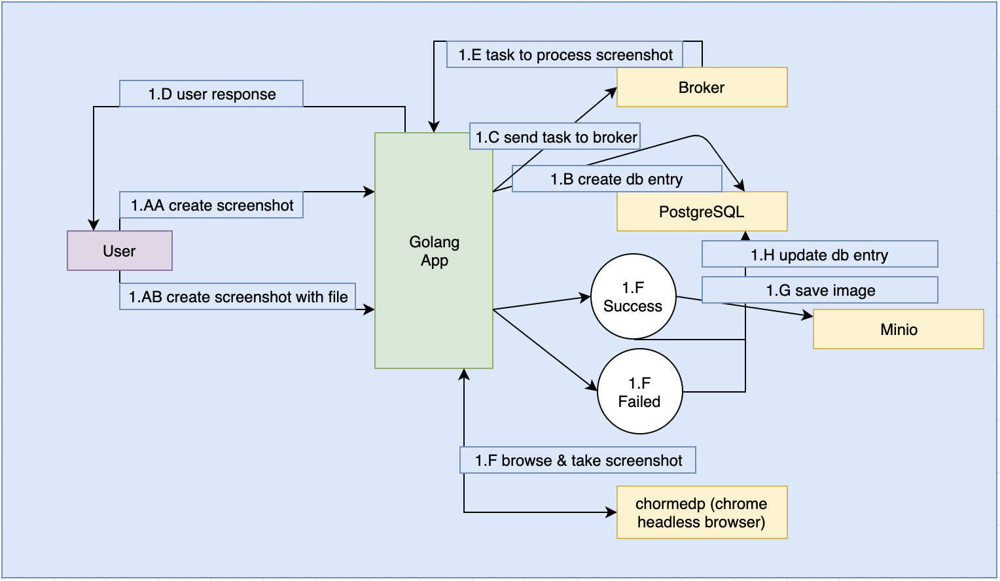

# Snapify
Screen shot as a service of web pages.

`docker image : s4kibs4mi/snapify:1.0.2`

#### Commands
* `instant` - takes an url as input and provides screen shot as output<br/>
    params:<br/>
        --url - url of the website.<br/>
        --out - directory where screen shot will be saved. 
* `serve` - runs a RESTful webservice<br/>
    params:<br/>
        --config_path - configuration file directory (see config.example.yml) for configuration example<br/>
        --config_name - name of the configuration file
* `migration up` - populates database schema (creates tables, columns, indexes etc)<br/>
    params:<br/>
        --config_path - configuration file directory (see config.example.yml) for configuration example<br/>
        --config_name - name of the configuration file        
* `migration down` - drops database schema (creates tables, columns, indexes etc)<br/>
    params:<br/>
        --config_path - configuration file directory (see config.example.yml) for configuration example<br/>
        --config_name - name of the configuration file        


#### Architecture
- Screen Shot Creation Flow


1. User sends screen shot creation request to web server.
2. Server receives the request and validates the data.
3. Server creates database entry and send tasks to rabbitmq as screen shot creation is a async task.
4. Server will get the screen shot creation task from rabbitmq.
5. Server will use chromedp to browse the url and taking screen shot.
6. If server succeed to take the screen shot it will update related data in database as done and save the image in minio to serve later.
7. If server fails to take the screenshot it will update related data in database as failed.
8. If user queries for data, server will pull data from database and serve the user.
9. If user ask to preview a screen shot, server will pull data from database and if the data marked as done, then will get image from minio and finally will serve the user screen shot image.

#### Database schema
```text
id string primary_key not_null
website string index not_null
stored_path string
created_at datetime index
updated_at datetime
status string index
```

#### Endpoints
* Create screen shot with json payload

`POST /v1/screenshots`
```json
{
    "urls": [
        "www.sakib.ninja",
        "www.codersgarage.com",
        "www.google.com"
    ]
}
```

Result `202`
```json
{
    "title": "Screenshot creation is in progress",
    "data": [
        {
            "id": "c0a10b26-ab7e-48c8-8e58-6bbeb8afe8a7",
            "status": "queued",
            "website": "www.sakib.ninja",
            "created_at": "2019-10-29T13:05:26.1003577Z",
            "updated_at": "2019-10-29T13:05:26.1003726Z"
        },
        {
            "id": "ce47935c-2afa-4c03-bcba-a211250dedae",
            "status": "queued",
            "website": "www.codersgarage.com",
            "created_at": "2019-10-29T13:05:26.1320367Z",
            "updated_at": "2019-10-29T13:05:26.13205Z"
        },
        {
            "id": "ae2742db-a3cc-4e1d-999b-f46355695c5b",
            "status": "queued",
            "website": "www.google.com",
            "created_at": "2019-10-29T13:05:26.1334529Z",
            "updated_at": "2019-10-29T13:05:26.1334668Z"
        }
    ]
}
```

* List screen shots

`GET /v1/screenshots?page={page}&limit={limit}`

Result `200`
```json
{
    "data": {
        "meta": {
            "current_page": 1,
            "page_limit": 10,
            "total": 15,
            "total_pages": 2
        },
        "screenshots": [
            {
                "id": "b1305a82-996c-492b-a932-db5a2cc16dfd",
                "status": "done",
                "website": "www.google.com",
                "created_at": "2019-10-29T09:00:38.750841Z",
                "updated_at": "2019-10-29T09:30:35.370862Z"
            },
            {
                "id": "70cb187b-f6f0-44a3-ba78-a43197b1bf4c",
                "status": "done",
                "website": "www.codersgarage.com",
                "created_at": "2019-10-29T09:00:38.734694Z",
                "updated_at": "2019-10-29T09:30:35.609259Z"
            },
            {
                "id": "29140d04-f35a-46ff-866e-aee1f9879ecb",
                "status": "done",
                "website": "www.sakib.ninja",
                "created_at": "2019-10-29T09:00:38.686813Z",
                "updated_at": "2019-10-29T09:30:55.145758Z"
            },
            {
                "id": "2c8dbe74-8a57-4393-a27f-1755ae9ac0c1",
                "status": "queued",
                "website": "www.google.com",
                "created_at": "2019-10-29T08:51:29.009733Z",
                "updated_at": "2019-10-29T08:51:29.009788Z"
            },
            {
                "id": "b3c78432-357c-4c57-ae39-c3e17d4b90be",
                "status": "queued",
                "website": "www.codersgarage.com",
                "created_at": "2019-10-29T08:51:29.008021Z",
                "updated_at": "2019-10-29T08:51:29.008129Z"
            },
            {
                "id": "b7232608-41fd-45a3-9989-dd6c8299598f",
                "status": "queued",
                "website": "www.sakib.ninja",
                "created_at": "2019-10-29T08:51:28.972604Z",
                "updated_at": "2019-10-29T08:51:28.972618Z"
            },
            {
                "id": "c13f6651-5028-4820-956d-f5682ae63dd7",
                "status": "queued",
                "website": "www.google.com",
                "created_at": "2019-10-29T08:44:00.68891Z",
                "updated_at": "2019-10-29T08:44:00.688925Z"
            },
            {
                "id": "220a3675-eaa0-45bc-b88f-5a37902e6b5a",
                "status": "failed",
                "website": "www.codersgarage.co",
                "created_at": "2019-10-29T08:44:00.687227Z",
                "updated_at": "2019-10-29T08:44:00.687357Z"
            },
            {
                "id": "bbcc7bbe-ed10-4826-8657-b9e5bb0d38f4",
                "status": "queued",
                "website": "www.sakib.ninja",
                "created_at": "2019-10-29T08:44:00.624945Z",
                "updated_at": "2019-10-29T08:44:00.624959Z"
            },
            {
                "id": "dc123a81-cfc8-44bb-8169-76036422ac4a",
                "status": "done",
                "website": "www.google.com",
                "created_at": "2019-10-29T08:04:03.476972Z",
                "updated_at": "2019-10-29T08:04:05.746757Z"
            }
        ]
    }
}
```

* View single screen shot

`GET /v1/screenshots/{screenshot_id}`

Result `200`
```text
The screen shot will be shown
```

* Create screen shots with file

`POST /v1/screenshots/files`

```text
Note : Add file payload in file key and send as form-data request.
URLs in file must be ; separated.
Check sites.example.txt for example.
```

Result `200`
```json
{
    "title": "Screenshot creation is in progress",
    "data": [
        {
            "id": "b92850c4-8791-406b-8b24-4e117b915b0c",
            "status": "queued",
            "website": "www.sakib.ninja",
            "created_at": "2019-10-29T20:08:25.503623+06:00",
            "updated_at": "2019-10-29T20:08:25.503623+06:00"
        },
        {
            "id": "a2480d38-5545-4e34-a595-92deaeadc751",
            "status": "queued",
            "website": "www.google.com",
            "created_at": "2019-10-29T20:08:25.511954+06:00",
            "updated_at": "2019-10-29T20:08:25.511954+06:00"
        },
        {
            "id": "37c86912-b20d-4363-9d24-793e52077f0a",
            "status": "queued",
            "website": "www.facebook.com",
            "created_at": "2019-10-29T20:08:25.513669+06:00",
            "updated_at": "2019-10-29T20:08:25.513669+06:00"
        },
        {
            "id": "d2e9f5b5-96d3-4b5a-b2b9-2ce3aaa9001a",
            "status": "queued",
            "website": "www.espn.org",
            "created_at": "2019-10-29T20:08:25.516736+06:00",
            "updated_at": "2019-10-29T20:08:25.516736+06:00"
        }
    ]
}
```

#### Dependencies

- PostgreSQL : As data storage
- RabbitMQ : To process task async
- Minio : To store images
- ChromeHeadless browser via chromedp : To browse website and take screenshots

#### App Build
```bash
./build.sh build
```

#### Docker Image Build
```bash
./build.sh docker {docker_version}
```

#### App Run
```bash
./build.sh run
```

#### Create database tables,
```bash
./build.sh up
```

## Run complete system
```bash
docker-compose up -d
```
```text
Web service will be running on port 9010.
To change check config.yml file.

Now enter into snapify docker container,

docker ps

docker exec -it {snapify_container_id} sh

Then in container execute,

snapify migration up --config_path /root/ --config_name config

You are ready to go.
```

Note :<br/>
config.yml configured to use in docker container.<br/>
config.example.yml configured to run locally.<br/>
Before running locally make sure dependencies are running and configured correctly.

*** Screen shot taking is a complex process it may take long time to complete the task.

#### [Postman Collection](https://www.getpostman.com/collections/30baacd0726c964733d4)
